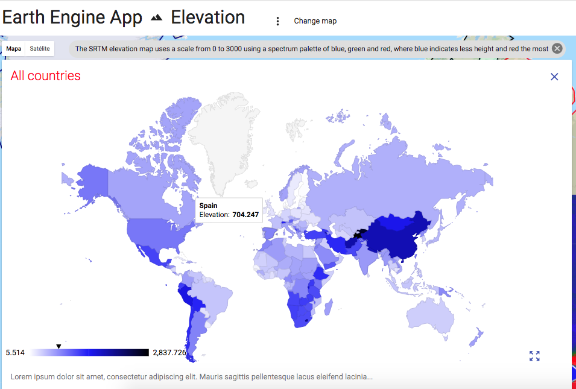
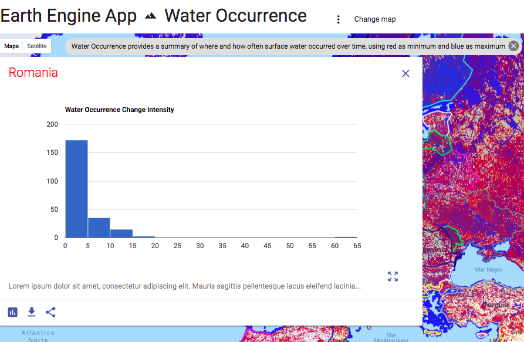
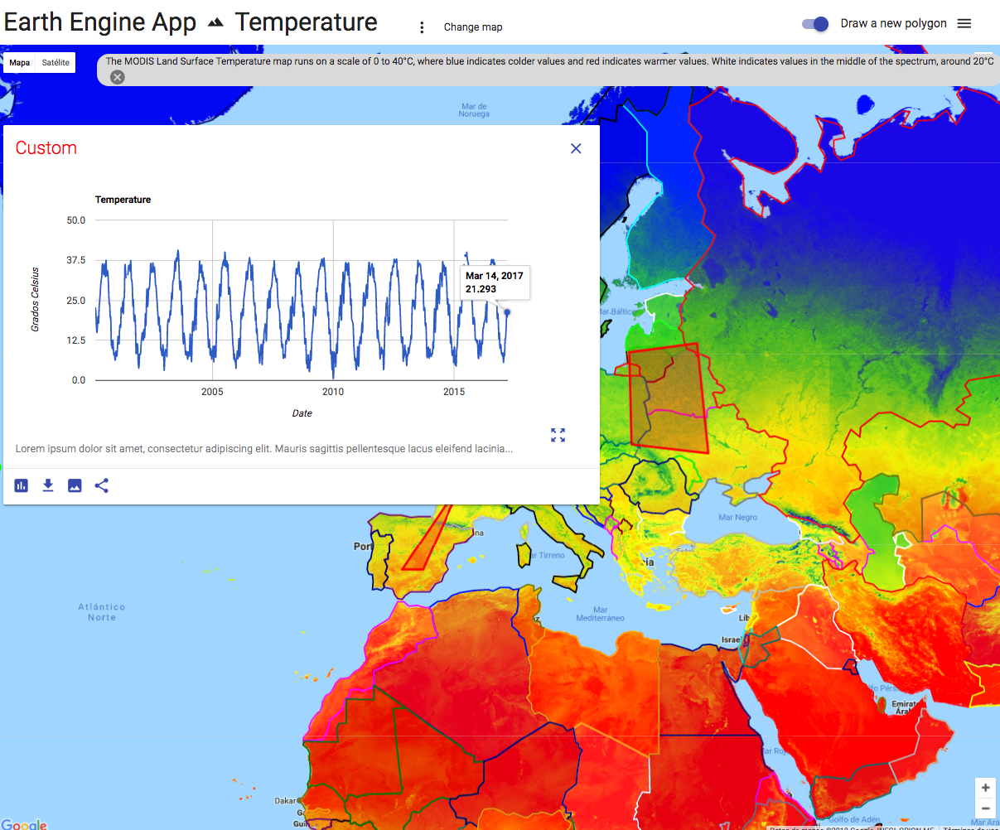

# Earth Engine App

---

Create dynamic maps using Google Earth Engine to study temperature, vegetation, elevation, deforestation and water occurrence and change of any country or your custom zone of interest.







## Installation and Usage
First, it is necessary to update the `config.py` properties.

### Install python dependencies
```sh
pip install -r requirements.txt
```

### Execute app
```sh
python main.py
```
Your app will be live on http://localhost:8080

## Requirements
- Python 2.7 or 3.6.
- Pip

[Apache 2.0 License](LICENSE.txt)

---